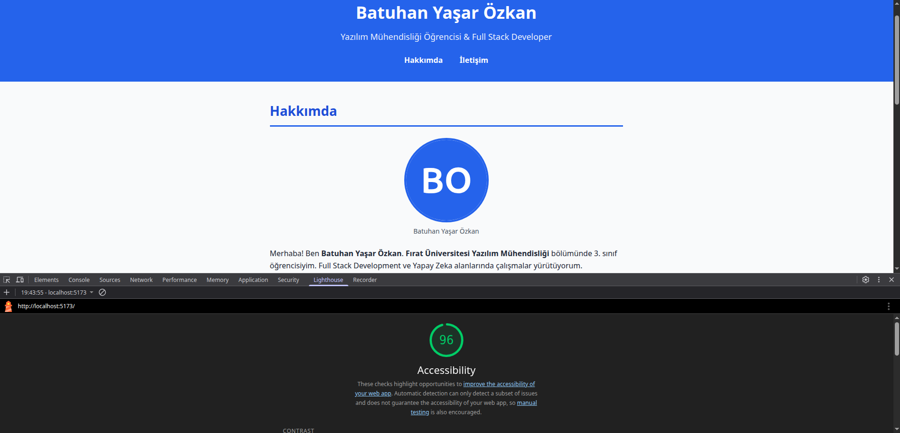

# Web Tasarımı ve Programlama - LAB Ödevi

<div align="center">



**Fırat Üniversitesi - Yazılım Mühendisliği**

Semantik HTML5 ve Erişilebilirlik odaklı kişisel portföy uygulaması

</div>

---

## Hakkında

Bu proje, **Fırat Üniversitesi Web Tasarımı ve Programlama** dersi kapsamında geliştirilmiş kişisel portföy web uygulamasıdır.

## Geliştirici

| Bilgi | Detay |
|-------|-------|
| **Ad Soyad** | Batuhan Yaşar Özkan |
| **Üniversite** | Fırat Üniversitesi |
| **Bölüm** | Yazılım Mühendisliği, 3. Sınıf |

## Kullanılan Teknolojiler

| Teknoloji | Açıklama |
|-----------|----------|
| **React 19** | Kullanıcı arayüzü kütüphanesi |
| **TypeScript** | Tip güvenli JavaScript |
| **Vite** | Hızlı geliştirme sunucusu ve build aracı |
| **HTML5 Semantik** | `<header>`, `<nav>`, `<main>`, `<section>`, `<article>`, `<footer>` |
| **CSS3** | Erişilebilir ve responsive tasarım |
| **ARIA** | Erişilebilirlik etiketleri ve rolleri |

## Kurulum

```bash
# Depoyu klonla
git clone <repo-url>
cd web-lab-hello

# Bağımlılıkları kur
npm install
```

## Çalıştırma

```bash
# Geliştirme sunucusunu başlat
npm run dev

# Üretim derlemesi oluştur
npm run build

# Üretim derlemesini önizle
npm run preview
```

## Proje Yapısı

```
web-lab-hello/
├── public/
│   └── resim1.png        # Profil görseli
├── src/
│   ├── App.tsx            # Ana uygulama bileşeni (semantik yapı)
│   ├── App.css            # Uygulama stilleri
│   ├── index.css          # Global CSS sıfırlama
│   └── main.tsx           # React giriş noktası
├── index.html             # HTML şablonu (lang="tr")
├── package.json           # Proje bağımlılıkları ve betikleri
├── tsconfig.json          # TypeScript yapılandırması
├── vite.config.ts         # Vite yapılandırması
└── README.md              # Bu dosya
```

## Erişilebilirlik Özellikleri

- **Skip Navigation** - Ana içeriğe atla bağlantısı (Tab ile görünür)
- **Heading Hiyerarşisi** - h1 > h2 > h3 sıralaması korunur
- **Label Eşleşmesi** - Tüm form elemanlarında `<label>` + `for`/`id`
- **ARIA Desteği** - `role="alert"`, `aria-describedby`, `aria-label`
- **Focus Göstergeleri** - Klavye navigasyonu için belirgin `outline`
- **Renk Kontrastı** - WCAG AA uyumlu (4.5:1 oran)

---

<div align="center">

**Batuhan Yaşar Özkan** | Fırat Üniversitesi | 2026

</div>
